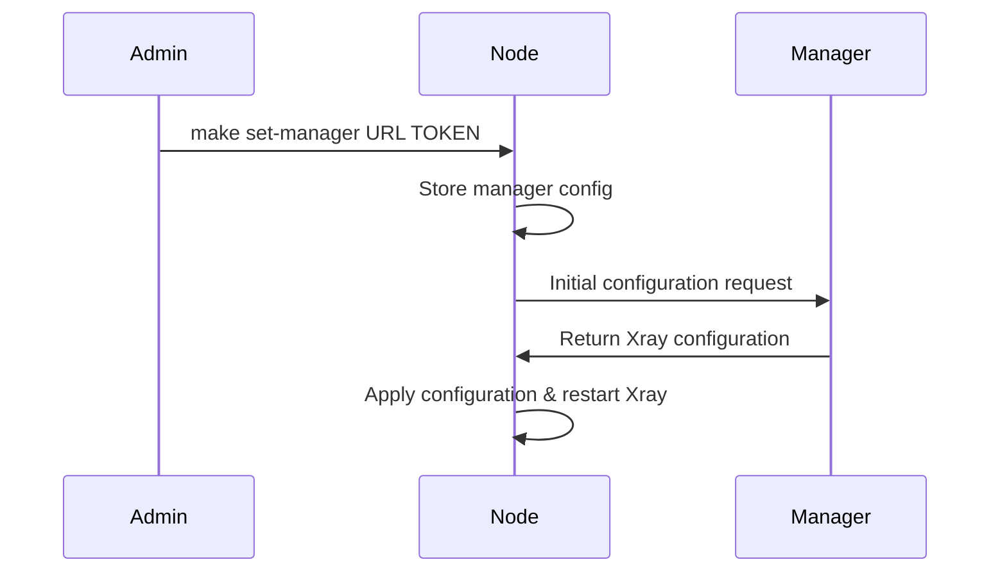
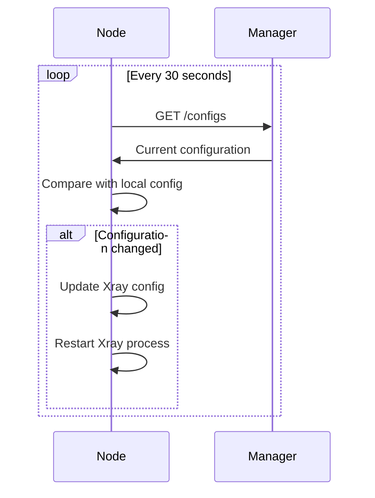
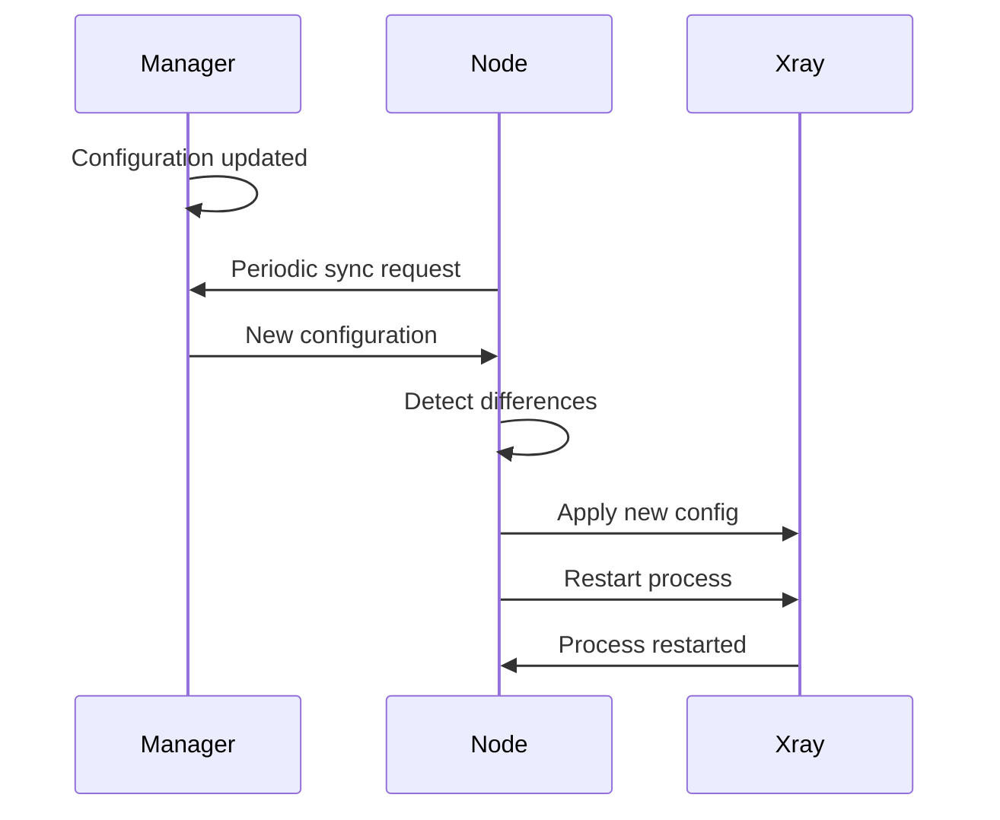

# Node-Manager Communication

## Overview

Arch-Node communicates with the Arch-Manager through a secure HTTP-based protocol. The node acts as a client that periodically synchronizes its configuration with the central manager and provides status updates.

## Connection Setup

### 1. Manual Registration

Nodes can be manually registered with a manager using the provided script:

```bash
# Using make command
make set-manager URL="https://your-manager.com/v1/nodes/1" TOKEN="your-token"

# Direct script execution
./scripts/set-manager.sh "https://your-manager.com/v1/nodes/1" "your-token"
```

### 2. API Registration

Nodes can also be registered programmatically via the REST API:

```bash
curl -X POST \
  -H "Content-Type: application/json" \
  -H "Authorization: Bearer <NODE_TOKEN>" \
  -d '{"url":"https://manager.example.com/v1/nodes/1","token":"manager-token"}' \
  http://localhost:<NODE_PORT>/v1/manager
```

### 3. Configuration Storage

Manager configuration is stored in the node's database (`storage/database/app.json`):

```json
{
  "settings": {
    "http_port": 15888,
    "http_token": "9CwH8bSQDR1nNtcO"
  },
  "manager": {
    "url": "https://manager.example.com/v1/nodes/1",
    "token": "manager-auth-token"
  }
}
```

## Communication Protocol

### 1. Authentication

**Node Authentication:**
- Each node has a unique HTTP token for API access
- Token is automatically generated on first startup
- Token is stored in `storage/database/app.json`

**Manager Authentication:**
- Manager provides a token for node-to-manager communication
- Token is included in all requests to the manager
- Token is passed as HTTP header or request parameter

### 2. Configuration Synchronization

The coordinator component handles automatic synchronization:

```go
// Sync runs every 30 seconds
func (c *Coordinator) Sync() error {
    if c.d.Data.Manager == nil {
        return nil // No manager configured
    }

    // Fetch configuration from manager
    remoteConfig, err := c.fetchConfig(c.d.Data.Manager)
    if err != nil {
        return err
    }

    // Compare and update if different
    if !c.xray.Config().Equals(remoteConfig) {
        c.xray.SetConfig(remoteConfig)
        go c.xray.Restart()
    }

    return nil
}
```

### 3. HTTP Requests

**Configuration Fetch:**
```http
GET /configs HTTP/1.1
Host: manager.example.com
Authorization: Bearer manager-token
X-App-Name: Arch-Node
X-App-Version: v25.8.21
```

**Response Format:**
```json
{
  "log": {
    "logLevel": "info",
    "access": "./storage/logs/xray-access.log",
    "error": "./storage/logs/xray-error.log"
  },
  "inbounds": [
    {
      "tag": "proxy",
      "protocol": "vmess",
      "port": 10001,
      "settings": {
        "clients": [...]
      }
    }
  ],
  "outbounds": [...],
  "dns": {...},
  "routing": {...}
}
```

## Node Discovery

### 1. Node Information

Nodes can provide their information for manager discovery:

```bash
# Get node information
make info

# Sample output:
IP: 192.168.1.100
DB: {"settings":{"http_port":15888,"http_token":"9CwH8bSQDR1nNtcO"},"manager":null}
```

### 2. Network Details

Each node exposes:
- **Public IP**: External IP address for client connections
- **HTTP Port**: Management API port (randomly assigned)
- **HTTP Token**: Authentication token for API access
- **Status**: Current operational status

### 3. Service Registration

When registering with a manager, provide:
- Node's public IP address
- Management API port
- Authentication token
- Node capabilities and version

## Manager API Requirements

### Expected Manager Endpoints

**Configuration Endpoint:**
```
GET /configs
Authorization: Bearer <token>
Content-Type: application/json

Response: Xray configuration JSON
```

**Node Registration (if supported):**
```
POST /nodes
Authorization: Bearer <manager-token>
Content-Type: application/json

Body: {
  "ip": "192.168.1.100",
  "port": 15888,
  "token": "9CwH8bSQDR1nNtcO",
  "version": "v25.8.21"
}
```

### Manager Client Identification

Nodes identify themselves to managers using HTTP headers:
- `X-App-Name: Arch-Node`
- `X-App-Version: v25.8.21`
- `Authorization: Bearer <token>`

## Communication Flow

### 1. Initial Registration



### 2. Ongoing Synchronization



### 3. Configuration Updates



## Error Handling

### 1. Connection Failures

- **Timeout Handling**: 20-second timeout for HTTP requests
- **Retry Logic**: Automatic retry on network failures
- **Graceful Degradation**: Continue operation with last known config
- **Error Logging**: Comprehensive error logging for debugging

### 2. Authentication Errors

- **Token Validation**: Verify tokens before making requests
- **Error Response**: Handle 401/403 responses gracefully
- **Token Refresh**: Support for token rotation (if implemented)

### 3. Configuration Errors

- **Validation**: Validate configuration before applying
- **Rollback**: Keep previous working configuration
- **Partial Updates**: Handle partial configuration updates
- **Error Recovery**: Automatic recovery from invalid configurations

## Security Considerations

### 1. Communication Security

- **HTTPS Required**: Always use HTTPS for manager communication
- **Token Security**: Secure storage and transmission of tokens
- **Certificate Validation**: Validate SSL certificates
- **Request Signing**: Optional request signing for enhanced security

### 2. Network Security

- **Firewall Rules**: Properly configure firewall for node communication
- **Port Management**: Use non-standard ports to avoid detection
- **IP Filtering**: Whitelist manager IP addresses
- **Rate Limiting**: Implement rate limiting on management API

### 3. Data Protection

- **Encryption**: Encrypt sensitive configuration data
- **Access Control**: Restrict access to configuration files
- **Audit Logging**: Log all configuration changes
- **Backup Security**: Secure backup procedures

## Troubleshooting

### Common Issues

1. **Connection Refused**
   ```bash
   # Check if manager URL is accessible
   curl -I https://manager.example.com/configs
   
   # Verify network connectivity
   ping manager.example.com
   ```

2. **Authentication Failures**
   ```bash
   # Check stored token
   cat storage/database/app.json | jq '.manager.token'
   
   # Test authentication manually
   curl -H "Authorization: Bearer <token>" https://manager.example.com/configs
   ```

3. **Configuration Sync Issues**
   ```bash
   # Check coordinator logs
   journalctl -u arch-node-1 | grep coordinator
   
   # Monitor real-time sync
   tail -f storage/logs/app-std.log | grep sync
   ```

### Debug Commands

```bash
# View current manager configuration
cat storage/database/app.json | jq '.manager'

# Check node information
make info

# Test manager connectivity
curl -H "Authorization: Bearer $(cat storage/database/app.json | jq -r '.manager.token')" \
     "$(cat storage/database/app.json | jq -r '.manager.url')"

# Monitor synchronization logs
journalctl -f -u arch-node-1 | grep -E "(coordinator|sync)"
```

This communication system ensures reliable, secure, and efficient coordination between distributed nodes and the central management system.
